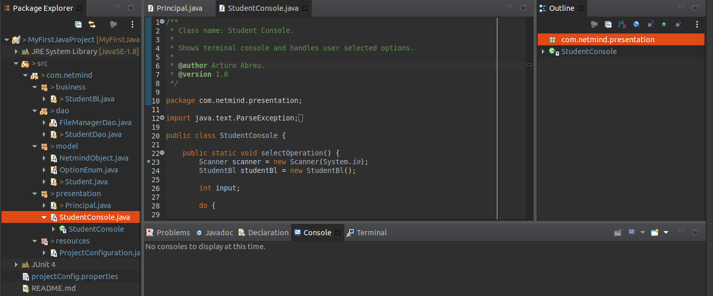

# My First Java Project
 

 
## Introduction
 
My First Java Project allows the user some functionalities related to students. Said functionalities can be hand picked by the user through the console:
 
1. Add new student.
2. Find the oldest student.
3. Find the average age in a group of students.
 
## Requirements
 
This project requires the following set up:
 
1. A working Java SE Development Kit 8 or greater.
2. A command-line interface to interact with the project.
 
## Installation
 
Not required.
